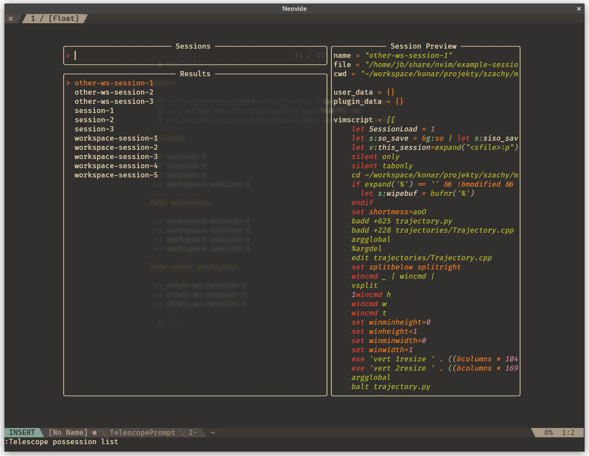

[](https://github.com/jedrzejboczar/possession.nvim/actions/workflows/lint.yml)

# possession.nvim

Flexible session management for Neovim.

## Features

* Save/load Vim sessions
* Keep track of last used session
* Sessions stored in JSON files
* Store arbitrary data in the session file
* User hooks before/after save/load
* Uses good old `:mksession` under the hood
* Configurable automatic save
* Out of the box [telescope.nvim](https://github.com/nvim-telescope/telescope.nvim) integration
* Example integration with [alpha-nvim](https://github.com/goolord/alpha-nvim)

## Overview

This is yet another session management plugin for Neovim.

The main goal was to make session management more flexible and overall more
Lua-friendly. All other session management plugins I know
(e.g. [auto-session](https://github.com/rmagatti/auto-session),
[persisted.nvim](https://github.com/olimorris/persisted.nvim),
[vim-obsession](https://github.com/tpope/vim-obsession),
[vim-startify](https://github.com/mhinz/vim-startify))
use Vim's `:mksession!` directly to generate Vimscript files that are later `:source`d.
This works well in general, but storing user data between sessions may be problematic.

To solve this issue `possession` uses JSON files to easily store session metadata.
Under the hood `:mksession!` is still used, but the resulting Vimscript is stored
in the JSON file along other data.

## Installation

With [packer.nvim](https://github.com/wbthomason/packer.nvim):

```lua
use {
    'jedrzejboczar/possession.nvim',
    requires = { 'nvim-lua/plenary.nvim' },
}
```

Or with other package managers/manually, but make sure
[plenary.nvim](https://github.com/nvim-lua/plenary.nvim) is installed.

## Configuration

**Detailed documentation**

See [doc/possession.txt](./doc/possession.txt).

**Quick start**

Call `require('possession').setup { ... }` somewhere in your `init.lua`.
The default configuration is:

```lua
require('possession').setup {
    session_dir = (Path:new(vim.fn.stdpath('data')) / 'possession'):absolute(),
    silent = false,
    load_silent = true,
    debug = false,
    prompt_no_cr = false,
    autosave = {
        current = false,  -- or fun(name): boolean
        tmp = false,  -- or fun(): boolean
        tmp_name = 'tmp',
        on_load = true,
        on_quit = true,
    },
    commands = {
        save = 'PossessionSave',
        load = 'PossessionLoad',
        delete = 'PossessionDelete',
        show = 'PossessionShow',
        list = 'PossessionList',
        migrate = 'PossessionMigrate',
    },
    hooks = {
        before_save = function(name) return {} end,
        after_save = function(name, user_data, aborted) end,
        before_load = function(name, user_data) return user_data end,
        after_load = function(name, user_data) end,
    },
    plugins = {
        close_windows = {
            hooks = {'before_save', 'before_load'},
            preserve_layout = true,  -- or fun(win): boolean
            match = {
                floating = true,
                buftype = {},
                filetype = {},
                custom = false,  -- or fun(win): boolean
            },
        },
        delete_hidden_buffers = {
            hooks = {
                'before_load',
                vim.o.sessionoptions:match('buffer') and 'before_save',
            },
            force = false,
        },
        nvim_tree = true,
        tabby = true,
        delete_buffers = true,
    },
}
```

## Recommendations

## Migrating

To migrate existing vimscript-based sessions use the `:PossessionMigrate` command.
It will try to generate session files in JSON format from given directory (or file).
The files will be stored in `session_dir` so make sure to use different directories.
Session name is assumed to be the filename without extension.

### Commands

The defaults command names are quite long, but shorter names can be configured:

```lua
require('possession').setup {
    commands = {
        save = 'SSave',
        load = 'SLoad',
        delete = 'SDelete',
        list = 'SList',
    }
}
```

### Session options

Under the hood this plugin uses the command `:mksession` which in turn uses `'sessionoptions'`
to "make" the session. See `:help 'sessionoptions'` for available options, some notable ones:

* `options` - Can mess things up, use only when you know what you're doing (Neovim has sane
  default of *not* including this one)
* `buffers` - While this plugin offers `delete_hidden_buffers`, I'd also suggest using
  `set sessionoptions-=buffers` to just exclude hidden buffers when saving session.

## Telescope

```lua
require('telescope').load_extension('possession')
```

Then use `:Telescope possession list` or `require('telescope').extensions.possession.list()`
The default action will load selected session.



## Auto-save

It is possible to automatically save the current session (or create a tmp session) when quitting
Neovim or loading a different session. This behavior is disabled by default, but can be enabled
using the `autosave.*` configuration options. Check [doc/possession.txt](./doc/possession.txt)
for details.

## Startup screen

Currently there is no out-of-the-box integration with any startup screen, PRs welcome.

The `require('possession.query')` module provides helper functions for querying available sessions.
It can be helpful when generating a startup screen. Take a look at the helper function
`workspaces_with_shortcuts` which implements all the burden of splitting sessions into workspaces
based on root directories specified by the user and will generate shortcuts for each group.
The resulting table can be used when generating a startup screen.

When using [alpha-nvim](https://github.com/goolord/alpha-nvim) there is an additional helper
function that generates a layout group that can be included in the startup screen.
Example usage:

```lua
local query = require('possession.query')
local workspaces = {
    {
        'Workspace A',  -- title
        'a',            -- shortcuts prefix
        {
            '/root/directory/a',
            '/other/root/directory/',
        },
    }, {
        'Workspace B',
        'b',
        '/root/directory/b',
    }
}
-- e.g. https://github.com/goolord/alpha-nvim/blob/8a1477d8b99a931530f3cfb70f6805b759bebbf7/lua/alpha/themes/startify.lua#L28
local create_button = function(shortcut, text, keymap)
    -- ...
end

local get_layout = function()
    return query.alpha_workspace_layout(workspaces, create_button, {
        others_name = 'Sessions Without Workspace',
    })
end

-- use with the rest of sections for alpha.nvim, with throttling to avoid reading files on each redraw
local utils = require('possession.utils')
local sections = {
    -- ...
    sessions = {
        type = 'group',
        val = utils.throttle(get_layout, 5000),
    },
    -- ...
}
```


